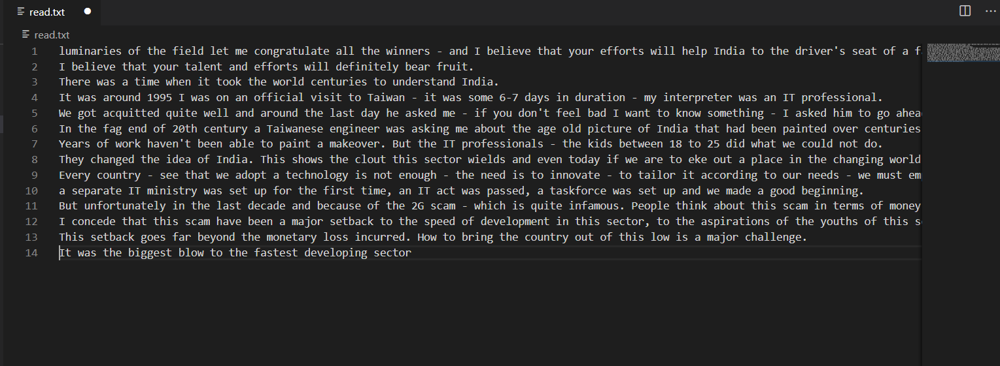
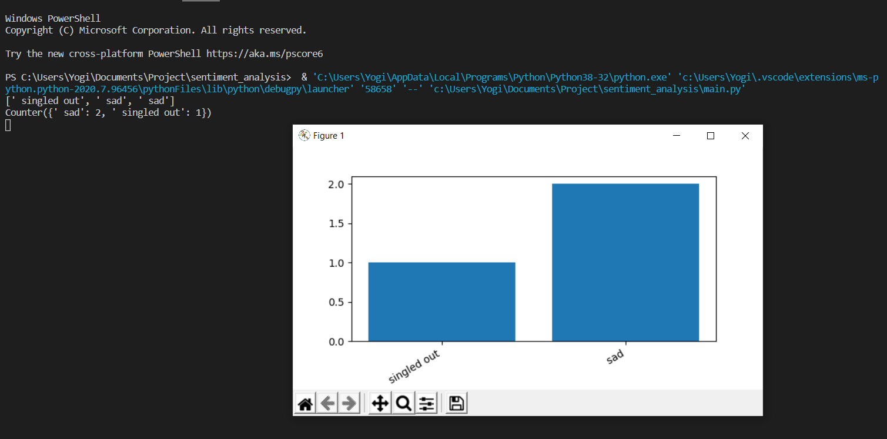

<h1>Sentiment Analysis</h1>
A program to analyse the emotion of given paragraph and textual comments.

<h2>Getting Started</h2>
This is a sentiment analysis or emotion analysis program with command line interface written in Python.

<h2>Prerequisites</h2>
Other Python libraries which is required in this project are :- 
1:- numpy 
2:- metplotlib

<h2>Deployment</h2>
In this project we have to give input in "read.txt" file. 
for example:-

Then we have to run the project and we get our required output. 
for example:-

